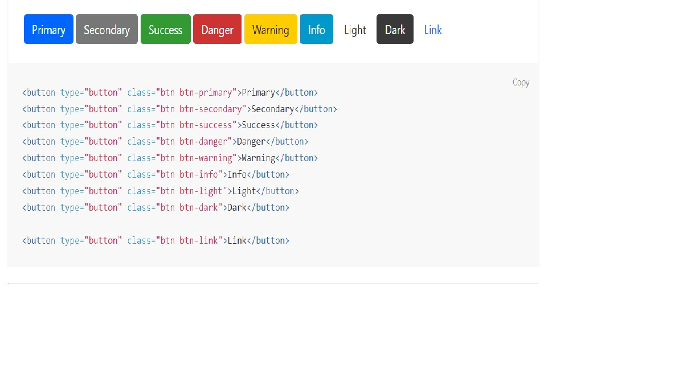
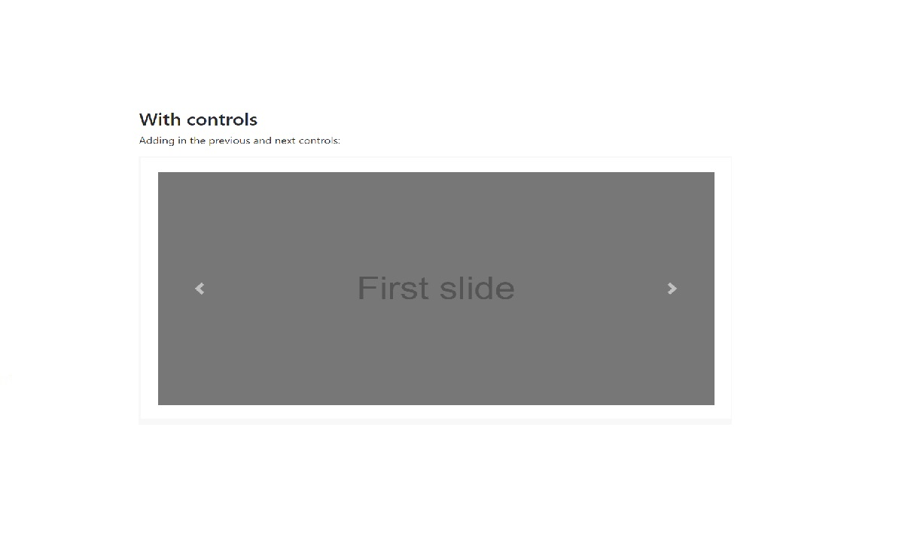
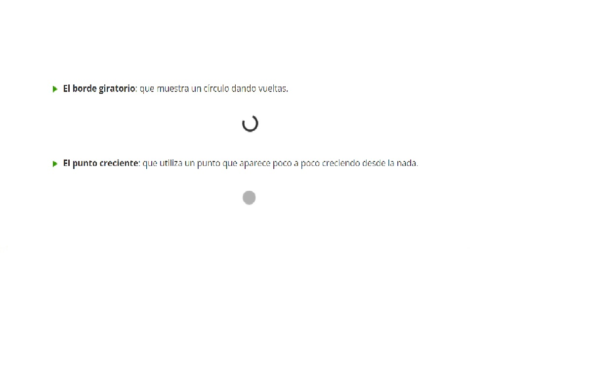
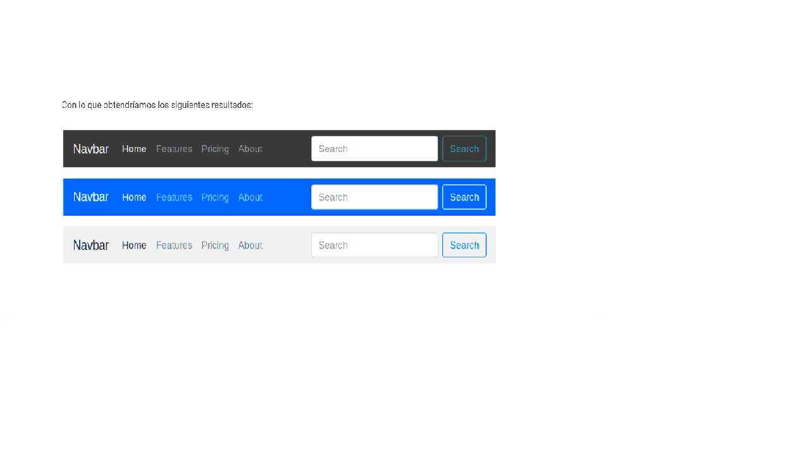
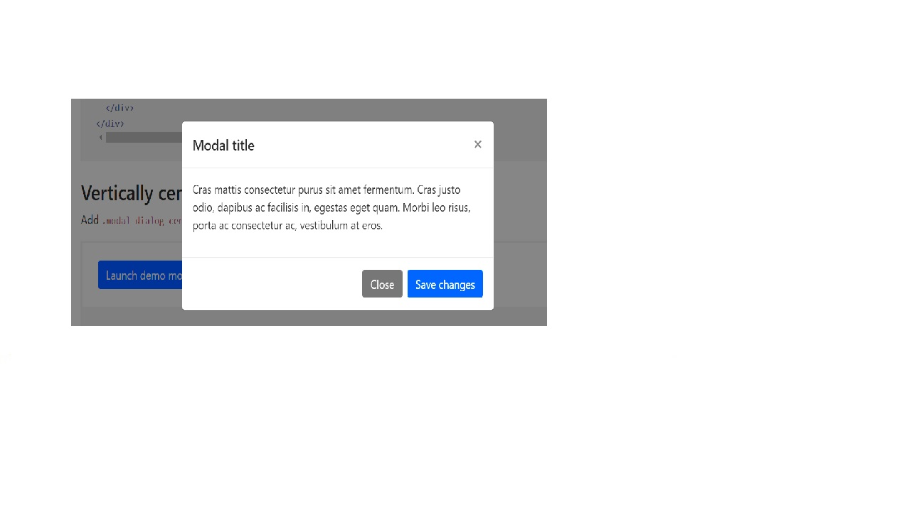
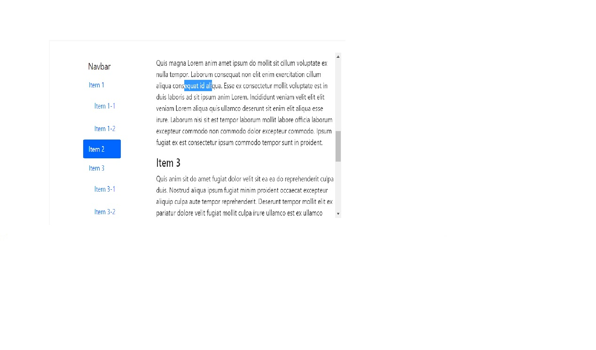

## Readme de Daniel 🙂 y Matías 🥸 </h1>

## Aquí podreis ver todas las cuestiones acerca de Bootstrap resueltas 😏 con la informacion que hemos encontrado en internet.

## Cuestiones acerca de bootstrap.

# 1.¿ Qué es bootstrap? ¿Para qué sirve? 👀
    Bootstrap es una librería multiplataforma o serie de herramientas para trabajar con el Front, es de codigo abierto y creada en 2015 por twitter, actualmenter la version es la 5.0.2. Con esta herramienta estilizas elementos del contenido en una web donde los users pueden crear practicamente cualquier tippo de pagina, además facil de replicar en otras paginas web, ya que copiando el codigo tienes la mayor parte realizada.

# 2. ¿por qué utilizarlo? 😯
    Basicamente para no quebrarte la cabeza, el hecho de que te de todos los componentes ya hechos, como tamaños, barras de navegación, clases entre otras cosas, te hace ahorrar tiempo y trabajar eficientemente, usarlo donde no se requiera un trabajo donde se requiera un diseño complejo.

# 3. Caracteristicas de bootstrap. 
    Tiene diversas caracteristicas entre otras, el hecho de que se trabaja en columnas. 
    
    Tiene soporte para flexbox, el cual usa trabajo en cajas, a parte da pie al uso de CSS Grid, pero solo de forma experimental.
    
    Tiene offCanvas el cual permite tener un bloque de info fuera del lienzo donde se trabaja.
    
    Su plpaceholder no es el mismo que en HTML, tiene ciertos efectos, como el de carga.

    Contiene con un colapse horizontal, a diferencia de antes que tenia vertical.

# 4. Ventajas de utilizar bootstrap. 🏂
    Puedes tener una web bien organizada, de forma rapida.

    Rapido acceso a iconos y desplegables combinando HTML CSS Y JS.
    Sea como sea el diseño, sera adaptable al dispositivo.

    Nos permite usar LESS Y SASS

    Tiene unbuen mantenimiento y actualizacion.

    Permite trabajar sin problema con CSS GRID, y tiene una configuración muy facil.

    Agilizará mucho la creación de páginas web y sus adaptaciones de móvil a ordenador.

# 4.1 Desventajas de bootstrap. ⛔
    Que los diseños son muy similares entre si, si muchos lo utilizan, tu pagina no destacara en nada.

    Tiene mucho codigo para los componentes… y si solo vas a utilizar una parte del Framework, no tiene sentido cargar todas las utilidades quqe esta pueda tener.

# 5. Como instalar bootstrap en mi proyecto.  🔧

     El primer metodo y la forma mas sencilla es a traves de CDN, content delivery network, se distribuye el contenido, lo que quiere decir que se descarga desde un servidor ajeno.

    Para empezar a usarlo, debemos insertar una llamada en nuestro HTML con dos archivos, un CSS y un JS.

--------------------------------------------------------------------

    Metodo 2: descargar los archivos en tu servidor.

    Pudiendo entrar en la pagina, descargando los archivos que lo componen, asi teniendo un control mas local de los elementos, evitando hacer llamadas a servidores externos.

# 6. ¿Se puede implementar responsive con Bootstrap? Pon un ejemplo.

    En bootstrap se puede implementar responsive, este tiene el sistema grid, el cual utiliza una serie de contenedores, a los cuales si se les da la propiedad adecuada en las columnas se reparten el espacio de igual forma.

    Este utiliza una serie de contenedores, filas y columnas para alinear el contenido, esta construido con flexbox y es completamente responsivo.

    Cada contenedor dividido en 12 secciones, te permite trabajar de forma, que utilizando una regla de 3, te permite adaptar un numero x de columnas en el espacio

# 7. ¿Que es n componente de bootstrap? Pon un ejemplo.

    Es una parte de la pagina, la cual tiene sus funcionalidades, como pueden ser los carruseles de imágenes.. popUps, pestañas modales.. o el menu responsive, en este link se pueden encontrar muchos de los componentes.

    https://getbootstrap.com/docs/5.2/components/carousel/#how-it-works

# 8. •	¿Hay muchos tipos de diseños en Bootstrap? Si los hay, explícalos.

    Fluid-layout : utiliza la clase bootstrap .container-fluid para el diseño. Este diseño utiliza valores proporcionales como unidades de medida para un bloque de contenido, imágenes o cualquier otro elemento. Se utiliza para crear un elemento que sea 100% más ancho y cubra todos los anchos de pantalla. El diseño fluido cambia continuamente de tamaño a medida que cambia el ancho de su navegador en cualquier cantidad, sin dejar ningún espacio vacío adicional en los lados. Por lo tanto, se denomina "diseño fluido".

    Diseño fijo : utiliza la clase bootstrap .container para el diseño. El diseño fijo tiene valores de ancho de píxel específicos que cambian su valor de ancho con la ayuda de consultas de medios. Proporciona un contenedor receptivo de ancho fijo. El diseño fijo cambia de tamaño en trozos en varios anchos determinados a medida que se especifican los valores de píxeles.

# 9. •	¿Cuáles son los diferentes tipos de botones en bootstrap? Pon ejemplos.  

# 9.5 Que es un carousel en bootstrap?

    Es un deslizador de contenido creado con CSS JS..
 

# 10. •	¿Que es un spinner de bootstrap? Pon un ejemplo

    Es un indicador de carga que se da cuando alguna paguina puede tenr un tiempo demorado de carga en el proceso

# 11 . ¿Que es un navBar de bootstrap? Pon un ejemplo.

    Herramienta de Bootstrap nos facilita la creación de la barra principal de navegación de nuestra web mediante la clase .navbar Esta barra se adaptará al tamaño de pantalla, mostrando los elementos colapsados en un botón en pantallas pequeñas y de forma normal para pantallas más grandes.

    <nav class="navbar navbar-dark bg-dark"></nav>
    <nav class="navbar navbar-dark bg-primary"></nav><nav class="navbar navbar-light" style="background-color: #e3f2fd;"></nav>

# 12 .	¿Que es un modal de bootstrap? Pon un ejemplo.

    ES UN PLUGIN PARA AÑADIR NOTIFICACIONES A CIERTO CONTENIDO , Y ASEA RANDOM O CONTENIDO COMO CAJAS, ARTICULOS ETC…
    Es un plugin para añadir notificaciones a cierto contenido, ya sea un contenido random o contenido como cajas, articulos etc...

# 13 . Existen inputs para subir archivos en Bootstrap? Pon un ejemplo.

    Si, son campos donde se pueden subir fotos, o cualquier tipo de objeto.

# 14 . 	¿Qué es un plugin scrollspy en Bootstrap?Pon un ejemplo.

         Actualizador automatico de la barra de navegación, el cual te situa en la parte de la pagina en la que te encuentras

